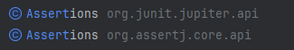

# 테스트코드 예제
## 간단한 카페 키오스크

### 시작하기에 앞서


---

### 1. 주문 목록에 음료 추가, 삭제 기능

### 2. 주문 목록 전체 지우기

### 3. 주문 목록 총 금액 계산하기

### 4. 주문 생성하기

---

## CHAPTER 1 : 자동화된 테스트를 실행하라.

```java
    @Test
    void add(){
        CafeKiosk cafeKiosk = new CafeKiosk();
        cafeKiosk.add(new Americano());

        System.out.println(">>> 담긴 음료 수 : " + cafeKiosk.getBeverages().size());
        System.out.println(">>> 담긴 음료 : " + cafeKiosk.getBeverages().get(0).getName());
    }
```

- add에 대한 테스트이지만, 어떤 것이 옳은 결과인지 알 수 없다.
- 즉, 옳은(혹은 틀린) 결과를 확인하는 내용이 들어가는 테스트를 짜자.
- 다만, 작은 코드 단위를 독립적으로 검증해야한다.
- 이는 모듈화가 잘 되어있어야 함을 의미한다.

- `핵심은 수동 테스트는 사람이 눈으로 확인하고, 자동화 테스트는 기계로 검증한다는 것이다.`

---

## CHAPTER 2 : 단위 테스트 자동화를 위한 Junit/AssertJ

- **우리는 2가지의 테스트 유형을 정의할 수 있다.**

### happy case

- 기능이 잘 되는가?

### exception case

- 기능에서 발생할 수 있는 예외를 제대로 던지는가?

### AssertJ

````
	testImplementation 'org.junit.jupiter:junit-jupiter:5.8.2'
	testImplementation 'org.assertj:assertj-core:3.23.1'
````

- 위는 assertJ의 의존성이다. 추가해주자.



- 위와 같이 2개의 Assertions가 보일 수 있는데, 아래가 assertJ이다.
- assertJ는 아래와 같이 테스트를 위해, chain 형태의 메서드들을 제공한다.

=> 그냥 테스트를 쉽고, 명확히 하기 위한 라이브러리라고 생각하자.

---

## CHAPTER 3 : 단위 테스트를 위한 분리

- 우리는 아래의 코드에서 시간에 따른 비즈니스 로직의 반응을 테스트하고 싶다.

````java
    public Order createOrder(){
        LocalDateTime now = LocalDateTime.now();
        LocalTime currentTime = now.toLocalTime();

        if(currentTime.isBefore(SHOP_OPEN_TIME) || currentTime.isAfter(SHOP_CLOSE_TIME)){
            throw new IllegalArgumentException("주문 시간이 아닙니다. 관리자에게 문의하세요.");
        }

        return new Order(LocalDateTime.now(), beverages);
    }
````

- 젠장, `LocalDateTime.now()` 때문에 테스트가 힘들어졌다.
- LocalDateTime에 createOrder()라는 메서드가 의존하고 있다.
- 예외가 발생할때까지 시간을 기다릴 것인가? 아니다. 코드를 바꿔보자.
- 우리는 LocalDateTime 자체의 테스트가 아니라, LocalDateTime에 따른 비즈니스 로직을 테스트해야한다.

````java
    public Order createOrder(LocalDateTime currentDateTime){
        LocalTime currentTime = currentDateTime.toLocalTime();

        if(currentTime.isBefore(SHOP_OPEN_TIME) || currentTime.isAfter(SHOP_CLOSE_TIME)){
            throw new IllegalArgumentException("주문 시간이 아닙니다. 관리자에게 문의하세요.");
        }

        return new Order(LocalDateTime.now(), beverages);
    }
````

- 메서드 밖에서 LocalDateTime을 받도록 분리시켜줬다.
- 이제 테스트에서는 LocalDateTime을 받아 사용하면 된다.
- 이처럼, 하나의 모듈이 다른 모듈을 `의존`하게 하면 안된다.
- 다만, input을 받아 `협력`하게 하자.

---

## CHAPTER 4 : 테스트하기 어려운 영역 확인 후 해결책 알아보기

- 위의 `LocalDateTime`처럼 테스트하기 어려운 모듈은 뭐가 있을까? 알아보자.

### 4-1. 관측할 때마다 다른 값에 의존하는 코드

#### 4-1-1. 종류

`LocalDateTime.now()`

`UUID.randomUUID()`

`System.currentTimeMillis()`

`Math.random()`

### 4-2. 외부 모듈에 영향을 주는 코드(API, DB 통신 등 네트워크 I/O)

#### 4-2-1. 종류

`DB 접근(JPA : save(), findById() 등)`

`외부 API 접근(webClient.{method}, redisTemplate.{method}, file I/O)`

### 4-3. 해결책

- 그냥 외부로 분리하자.(통신만하는 클래스를 만들라는 뜻이다.)
- Input, Output, 기능(통신)을 책임지는 클래스(모듈)을 만들 수 있다.


- 그 값을 받아서 사용하는 모듈은 그냥 객체를 만들어 테스트한다.
- 만약, 외부 API 응답도 테스트가 필요하다면, 찾아서 그 모듈만 테스트한다.

---

## CHAPTER 5 : TDD?

- 아래는 TDD의 진행 순서이다.

### 5-1. RED

- 실패하는 테스트 작성
- 목표: 테스트에 given/when/then을 추가 후 테스트 목적을 분명히 한다.

````java
    public int calculateTotalPrice(){
        return 0;
    }
````
- 어처구니 없는 코드이다.
- 그냥, "이런 API가 필요할 것이다!"라고 선언한다.
- 이 단계는 구현이라 치지 않는다. 그냥 API만 명세한 것이다.

````java
@Test
void calculateTotalPrice(){
    CafeKiosk cafeKiosk = new CafeKiosk();
    Americano americano = new Americano();
    Latte latte = new Latte();

    cafeKiosk.add(americano);
    cafeKiosk.add(latte);

    int totalPrice = cafeKiosk.calculateTotalPrice();

    assertThat(totalPrice).isEqualTo(8500);
}
````

- 총 가격을 계산하는 테스트이다.
- 실패할 것을 예상하고 작성했다.

### 5-2. GREEN

- 테스트 통과위한 최소한의 코딩
- 미리 짜놓은 테스트는 이 메서드의 목적이 된다.
- 즉, 목적에 맞게(테스트 통과) 메서드를 작성한다.

````java
public int calculateTotalPrice(){
    int totalPrice = 0;
    for(Beverage beverage : beverages){
        totalPrice += beverage.getPrice();
    }
    return totalPrice;
}
```` 

### 5-3. REFACTOR

- 구현 코드 개선
````java
    public int calculateTotalPrice(){
        return beverages.stream()
                .mapToInt(Beverage::getPrice)
                .sum();
    }
````

- 리팩터링 이후, 테스트를 돌려본다.

### 5-4. 왜 테스트 작성 후 기능을 구현하는가?
                         
- 테스트로 많은 예외 케이스를 정의하고, 그에 맞춰 대응할 수 있게 한다.
- 쉽게 발견하기 어려운 엣지 케이스를 놓치지 않을 수 있다.
- 구현 후 테스트만 실행해 구현에 대한 빠른 피드백을 받을 수 있다.
- 과감한 리팩토링이 가능해진다.(테스트만 잘 돌아가면 되기 때문)

---

## CHAPTER 6 : 테스트의 문서화(테스트 코드 깔끔하게)

### 6-1. DisplayName

초기 : `특정 시간 이전에 주문을 생성하면 실패한다.`

변경 : `영업 시작 시간 이전에는 주문을 생성할 수 없다.`
   
=> 도메인에 맞춰서 작성할 것.

### 6-2. BDD
                 
- 행위 주도 개발 : 사용자의 요구사항을 중심으로 개발 프로세스를 진행한다.

#### GIVEN

- 테스트 준비(시나리오 시작 이니셜라이즈)

#### WHEN

- 비즈니스 로직(단위) 실행
- 테스트의 주체이다. "이 메서드를 실행하는 것을 테스트하겠다!" 이뜻임.

#### THEN

- 기댓값 비교

---

````java
    @DisplayName("주문 목록에 담긴 상품들의 총 금액을 계산할 수 있다.")
    @Test
    void calculateTotalPrice(){
        // given
        CafeKiosk cafeKiosk = new CafeKiosk();
        Americano americano = new Americano();  //4000원
        Latte latte = new Latte();              //4500원

        cafeKiosk.add(americano);
        cafeKiosk.add(latte);

        //when
        int totalPrice = cafeKiosk.calculateTotalPrice();

        //then
        assertThat(totalPrice).isEqualTo(8500);
    }
````

## CHAPTER 7 : 테스트를 위한 Layer Architecture

---

## CHAPTER 8 : Infra-Structure 레이어 테스트

### `외부 API나 DB와의 통신이 제대로 되는지 확인한다.`

````java
    @DisplayName("원하는 판매상태를 가진 상품들을 조회한다.")
    @Test
    void findAllBySellingStatusIn(){
        //given
        Product product1 = Product.builder()
                .productNumber("001")
                .type(ProductType.HANDMADE)
                .sellingStatus(SELLING)
                .name("아메리카노")
                .price(4000)
                .build();

        Product product2 = Product.builder()
                .productNumber("002")
                .type(ProductType.HANDMADE)
                .sellingStatus(HOLD)
                .name("카페라때")
                .price(4000)
                .build();

        Product product3 = Product.builder()
                .productNumber("003")
                .type(ProductType.HANDMADE)
                .sellingStatus(STOP_SELLING)
                .name("팥빙수")
                .price(7000)
                .build();
        productRepository.saveAll(List.of(product1, product2, product3));

        //when
        List<Product> products = productRepository.findAllBySellingStatusIn(List.of(SELLING, HOLD));

        //then
        Assertions.assertThat(products).hasSize(2)
                .extracting("productNumber", "name", "sellingStatus")
                .containsExactlyInAnyOrder(
                        Tuple.tuple("001", "아메리카노", SELLING),
                        Tuple.tuple("002", "카페라때", HOLD));
    }
````

- 상품 엔티티를 직접 만들고, INSERT 후 SELECT 해오는 테스트이다.
- 즉, Infra-Structure 레이어는 "외부 API와 잘 통신을 하는가?"를 확인하면 된다.
- `예외가 발생한다면, 와이어 샤크나, 세션 체크 등으로 문제를 해결하자.`


- 아래는 yml이다.

````
spring:
  h2:
    console:
      enabled: true
      path: /h2-console
  datasource:
    driver-class-name: org.h2.Driver
    url: jdbc:h2:mem:db;DB_CLOSE_DELAY=-1;MODE=MYSQL;
    username: sa
    password:
  jpa:
    properties:
      hibernate:
        show-sql: true
        format-sql: true
    hibernate:
      ddl-auto: create-drop
    defer-datasource-initialization: true
    database: h2
    database-platform: org.hibernate.dialect.H2Dialect

  sql:
    init:
      mode: never
      data-locations:
        - classpath:product-insert.sql
````

---

## CHAPTER 9 : DOMAIN 레이어 테스트

### Domain의 로직은 Entity(JPA)나 VO(외부 API)를 받아온다.
- 다른 가공하는 로직은 business 레이어가 책임지기에, 여기서는 가공하지 않는다.
- 만약, 하나의 커넥션(트랜잭션)에 여러 값을 가져와야한다면, VO를 만들어주자.
- 트랜잭션의 범위 설정 또한 business 레이어의 책임이기에, Domain 로직은 오로지 순수 자바 코드만 들어간다.


